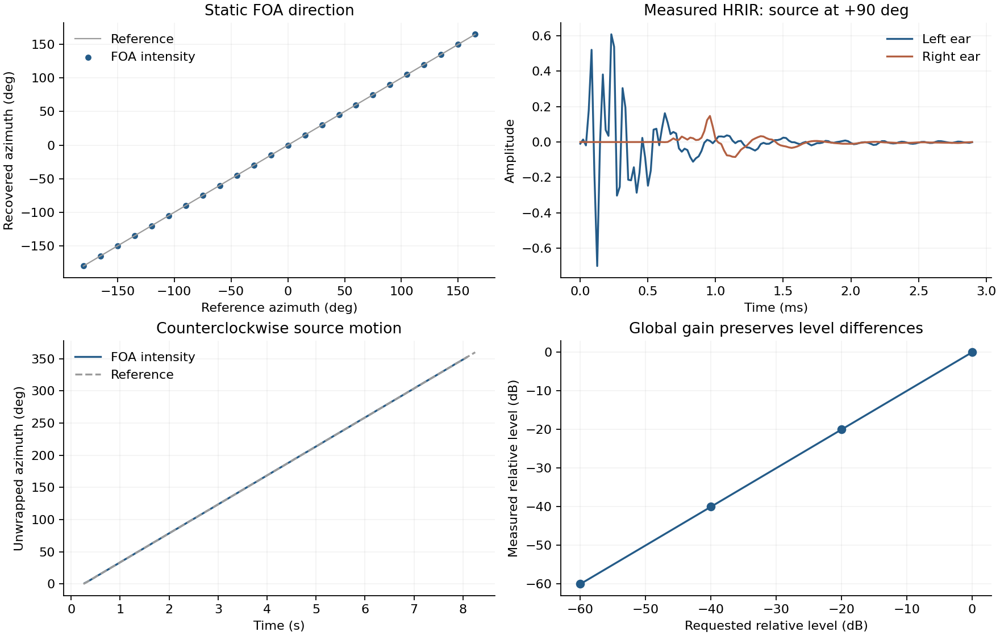

# 数值检查结果

状态：已验证，通过。
本次读取 80 个场景、403 个 WAV 文件。音频文件共 520.7 MB。
检查对象是文件、声道关系、生成标签和渲染计算；这里没有把任何模型性能或主观听感标记为通过。

|检查|结果|
|---|---|
|all_wav_integrity|通过|
|hrtf_archive_hash|通过|
|foa_reconstructed_from_stems|通过|
|stereo_reconstructed_from_stems|通过|
|binaural_reconstructed_from_stems_and_hrtf|通过|
|paired_lengths|通过|
|single_source_foa_direction|通过|
|binaural_grid_coverage|通过|
|no_binaural_nadir_substitution|通过|
|normalization_roundtrip|通过|
|yaw_rotation|通过|
|left_right_mirror|通过|
|negative_controls_are_detectable|通过|
|stereo_antiphase_downmix|通过|
|analytic_itd_sign_and_samples|通过|
|analytic_ild_sign_and_db|通过|
|measured_hrtf_left_right_orientation|通过|
|measured_hrtf_frontal_symmetry|通过|
|exact_digital_silence|通过|
|impulse_event_samples|通过|
|level_ratios_preserved|通过|
|interference_source_energy_ratios|通过|
|sample_rate_compatibility|通过|
|reference_timeline|通过|
|model_input_manifest|通过|

完整数值见 [report.json](report.json)。

